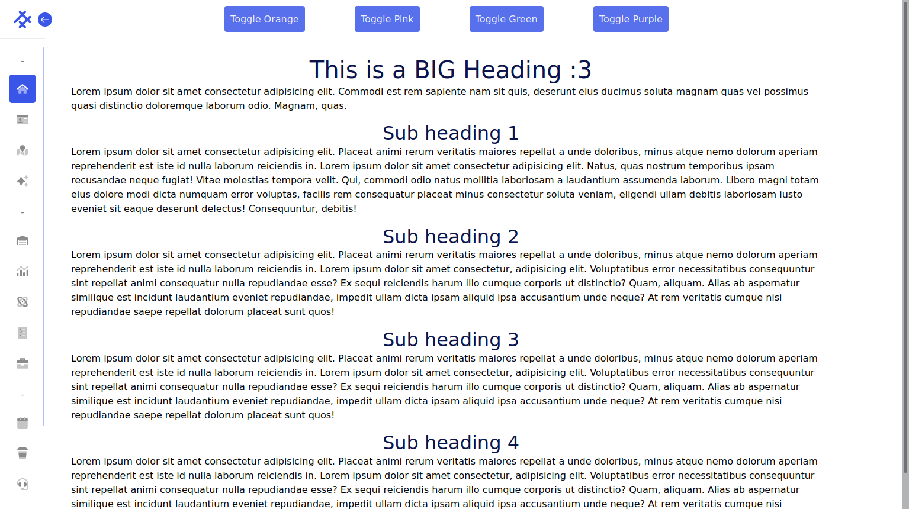
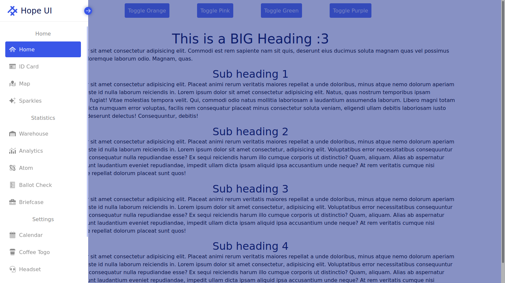
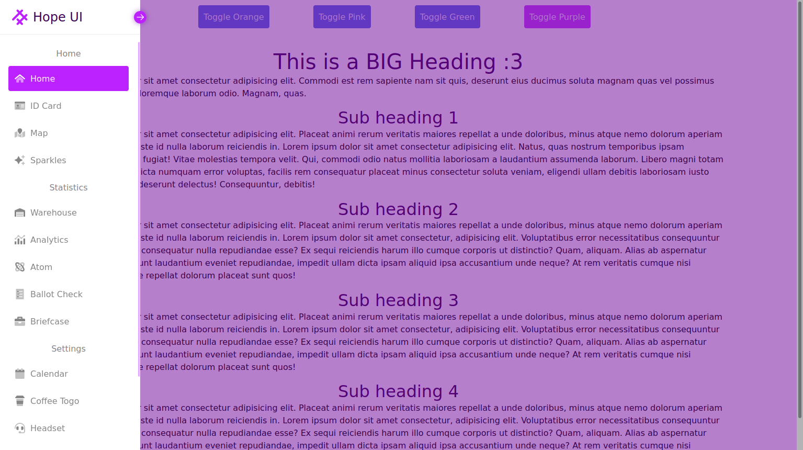
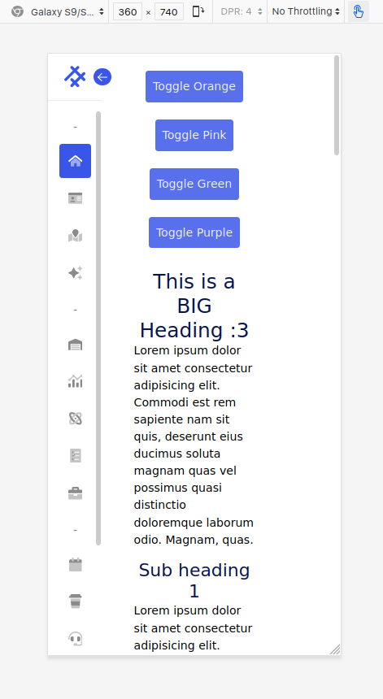

# Static Sidebar Challenge

Sidebar was made only with HTML and CSS (Static, not JS)

Click on the ./index.html to see the sidebar. It uses ./style.css as it's CSS. Other directories are for references.

### **SideBar features:**
1. Responsive
2. Expand and Collapse
3. Can Collapse by clicking outside the sidebar
4. Show icon but hide nav-item text when collapsed _(Hacky)_
5. Toggle between themes (Blue, Orange, Pink, Gold) _(Hacky)_
6. Animations

### Showcase:

### **Credits**
+ SideBar was inspired by [Hope UI](https://templates.iqonic.design/hope-ui/html/dist/dashboard/index.html) and FireShip's [css nav](https://youtu.be/biOMz4puGt8) as well as [css dropdown](https://youtu.be/rXuHGLzSmSE).
+ Icons are made by [Font Awesome](https://fontawesome.com/v5.15/icons).
  
